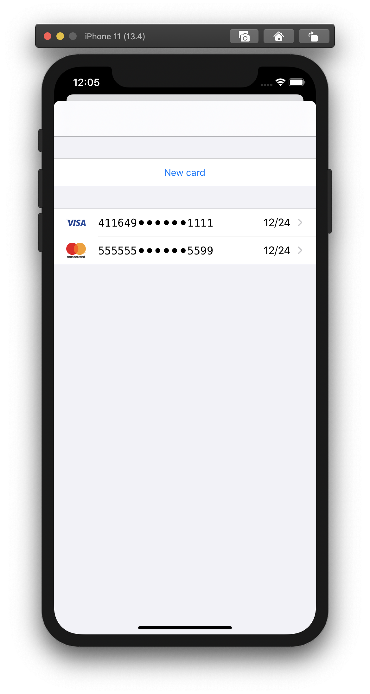
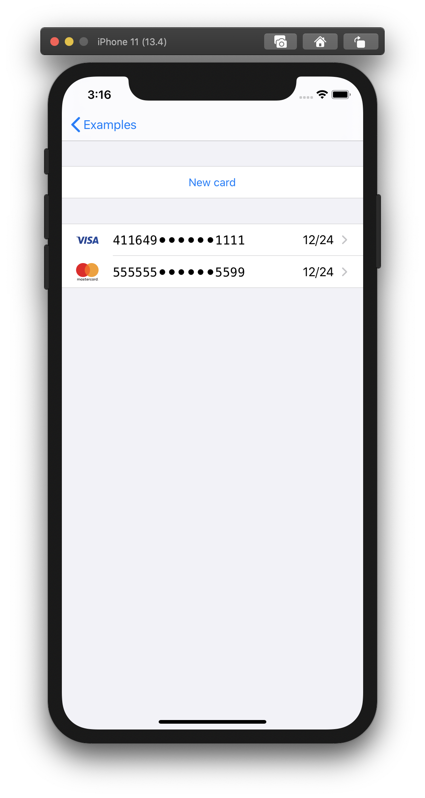
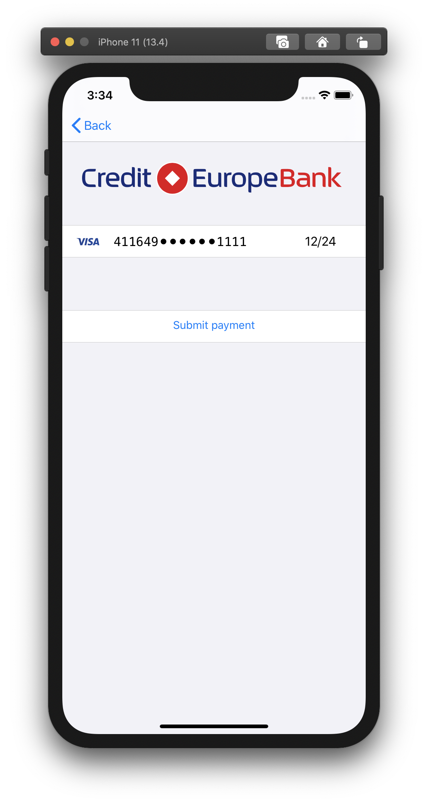
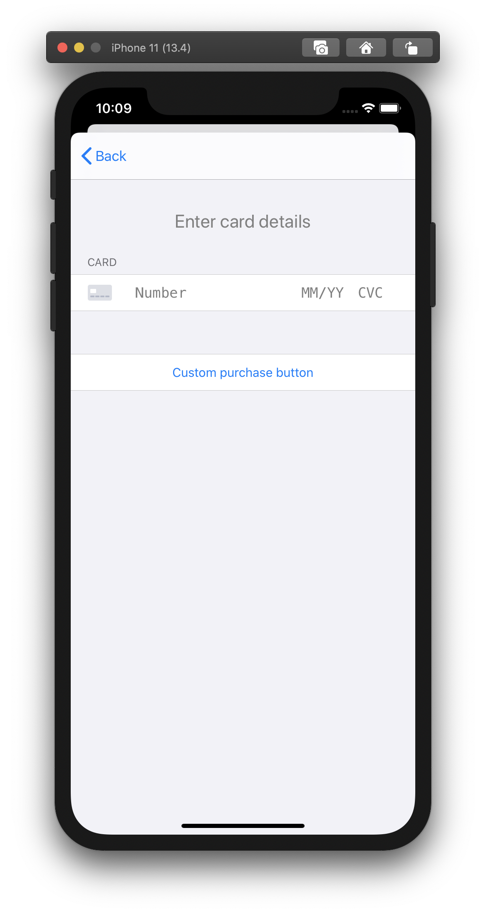
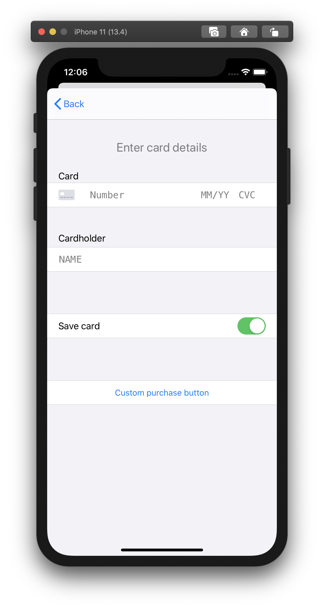
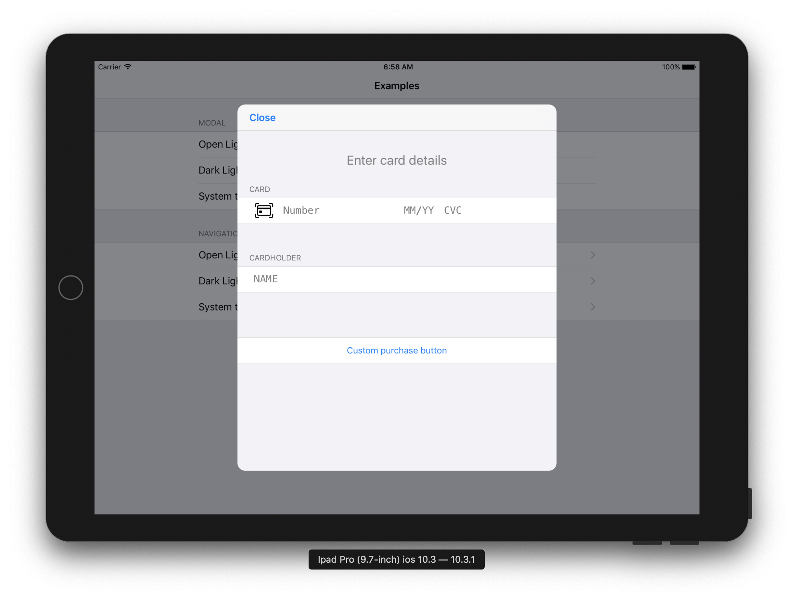
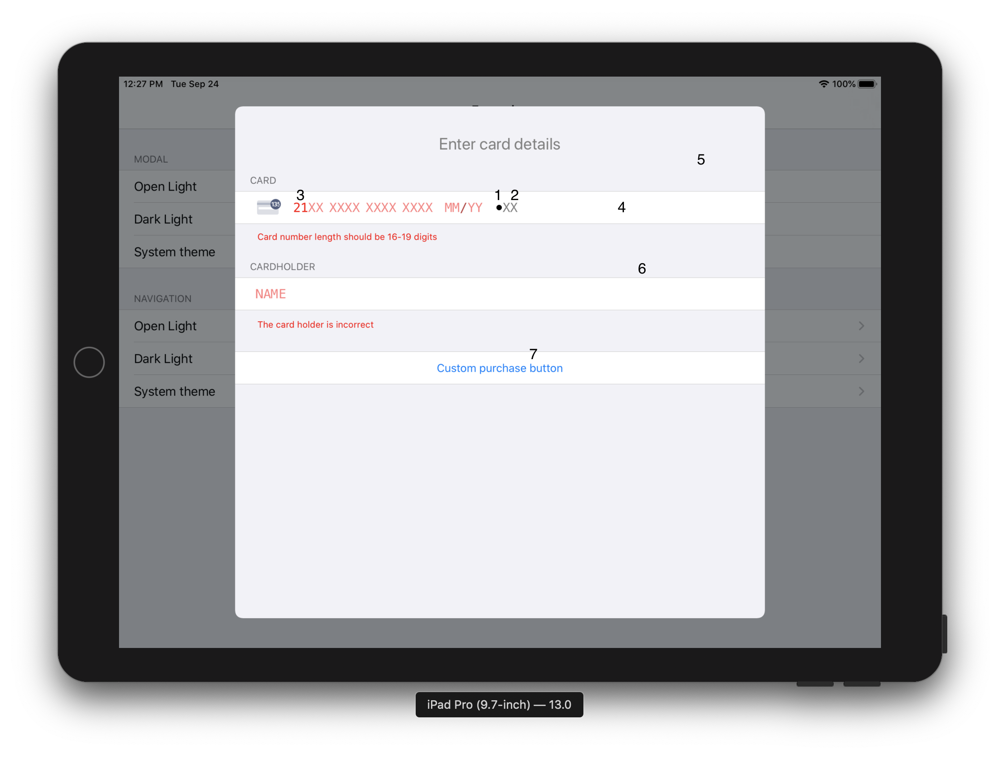

# Документация CardKit SDK

SDK содержит два класса и один делегат.

[Инструкция интеграции SDK](Tutorial.md) <br/>
[Инструкция интеграции Apple pay](TutorialApplePay.md)

## Настройка параметров SDK

### 1. Выбор темы

```swift
// Светлая тема
 CardKConfig.shared.theme = CardKTheme.light();

// Темная тема
 CardKConfig.shared.theme = CardKTheme.dark();

// Системная тема iOS ТОЛЬКО ДЛЯ IOS 13.0+ (поддерживает авто переключение)
 CardKConfig.shared.theme = CardKTheme.system();
```

### 2. Локализация

```swift
 // language = "ru" | "en" | "es" | "de" | "fr" | "uk";
 CardKConfig.shared.language = language;
```

### 3. Свойства объекта CardKConfig

| Название Свойства  |   Тип данных   |   Значение по умолчанию   | Опциональное | Описание                                                               |
| :----------------: | :------------: | :-----------------------: | :----------: | ---------------------------------------------------------------------- |
|       theme        |   CardKTheme   | CardKTheme.defaultTheme() |      Да      | Цветовая тема пользовательского интерфейса                             |
|      language      |     String     |            nil            |      Да      | Язык пользовательского интерфейса                                      |
| bindingCVCRequired |      BOOL      |          `false`          |      Да      | Обязательный ввод CVC оплачивая ранее сохранненой картой               |
|     isTestMod      |      BOOL      |          `false`          |      Да      | Запуск в тестовом режиме, для выбора тестовых ключей.                  |
|      mdOrder       |     String     |             -             |     Нет      | идентификатор заказа который нужно оплатить криптограммой              |
|      bindings      | [CardKBinding] |             -             |     Нет      | Массив связок                                                          |
|    cardKProdKey    |     String     |    `<Публичный ключ>`     |      Да      | Публичный ключ для продакшина                                          |
|    cardKTestKey    |     String     |    `<Публичный ключ>`     |      Да      | Публичный ключ для тестирования                                        |
|      testURL       |     String     |          `<URL>`          |      Да      | URL для запроса тестового ключа                                        |
|      prodURL       |     String     |          `<URL>`          |      Да      | URL для запроса продакшин ключа                                        |
|      mrBinURL      |     String     |            nil            |     Нет      | URL корень для отображения картинки например: `https://mrbin.io/bins/` |
|    mrBinApiURL     |     String     |            nil            |     Нет      | URL для определения банка                                              |

### 4. Пример

```swift
  ...
  CardKConfig.shared.theme = CardKTheme.dark();
  CardKConfig.shared.language = "";
  CardKConfig.shared.bindingCVCRequired = true;
  CardKConfig.shared.bindings = [];
  CardKConfig.shared.isTestMod = true;
  CardKConfig.shared.mdOrder = "mdOrder";
  ...
```

## Свойства объекта CardKViewController

|   Название Свойства    |           Тип данных            |  Значение по умолчанию  | Опциональное | Описание                                   |
| :--------------------: | :-----------------------------: | :---------------------: | :----------: | ------------------------------------------ |
|      cKitDelegate      | id<CardKViewControllerDelegate> |          `nil`          |     Нет      | -                                          |
|   allowedCardScaner    |              BOOL               |         `false`         |      Да      | Разрешить исспользование сканера карточки. |
|  purchaseButtonTitle   |             String              | `Purchase` / `Оплатить` |      Да      | Переопределения текста кнопки.             |
|    allowSaveBinding    |              BOOL               |         `false`         |      Да      | Отобразить тумблер "Сохранить карут"       |
|     isSaveBinding      |              BOOL               |         `false`         |              | Значение тумблера по умолчанию             |
| displayCardHolderField |              BOOL               |         `false`         |              | Отображать поле ввода обладателя карты     |

## Инициализация контроллера

### 1. Описание аргументов

Для отображения sdk необходимо вызвать статический метод `create` класса CardKViewController.
Аргументы функции `create`:

|  Название аргумента  |       Тип данных       | Значение по умолчанию | Опциональное | Описание                                      |
| :------------------: | :--------------------: | :-------------------: | :----------: | --------------------------------------------- |
|         self         |    UIViewController    |         `nil`         |     Нет      | ссылка главного контроллера                   |
| navigationController | UINavigationController |         `nil`         |      Да      | навигационный контроллер                      |
|      controller      |  CardKViewController   |         `nil`         |     нет      | инициализированный объект CardKViewController |

Результат функции `create` - объект класса `UIViewController`

```swift
  let controller = CardKViewController();
  controller.cKitDelegate = self;
  CardKViewController.create(self, navigationController: self.navigationController, controller: controller);
```

### 2. Отображение контроллера в модальном окне или на новой странице

Для выбора отображения в модальном окне или на новой странице отвечает аргумент `navigationController` в функции `create`. Если `navigationController` == `nil` тогда результатом функции будет навигационный контроллер, в противном случае вернется `UIViewController`.

В таком случае, если необходимо отобразить в модальном окне, тогда `navigationController` передовать **_не нужно_**.

```swift
  let controller = CardKViewController();
  controller.cKitDelegate = self;
  let createdNavController = CardKViewController.create(self, navigationController: nil, controller: controller);

  self.present(createdNavController, animated: true, completion: nil);
```

<div align="center">
  
</div>

<div align="center"> Рисунок 1. Контроллер в модальном окне. </div>

Если необходимо отобразить на новой странице, тогда `navigationController` **_обязателен_**.

```swift
  let controller = CardKViewController();
  controller.cKitDelegate = self;
  let createdNavController = CardKViewController.create(self, navigationController: self.navigationController, controller: controller);

  self.navigationController?.pushViewController(createdNavController, animated: true);
```

<div align="center">
  
</div>

<div align="center"> Рисунок 2. Контроллер на новой странице </div>

## Работа со связками

### 1. Отображение связок

Контроллер со списком связок отобразиться, если массив `bindings` в `CardKConfing` не пустой массив. Если массив пустой, то будет отображаться форма создания новой карты.

Свойства объекта `CardKBinding`:

| Название Свойства | Тип данных | Значение по умолчанию | Опциональное | Описание            |
| :---------------: | :--------: | :-------------------: | :----------: | ------------------- |
|     bindingId     |   Number   |           -           |     Нет      | Id связки           |
|   paymentSystem   |   String   |           -           |     Нет      | Платежная система   |
|    cardNumber     |   String   |           -           |     Нет      | Номер карты         |
|    expireDate     |   String   |           -           |     Нет      | Срок действия карты |

<div align="center">
   
</div>

<div align="center"> Рисунок 3. Список связок </div>

### 2. Отображение поля CVC

Для отображение поля CVC в форме оплаты выбранной связки необходимо присвоить значение `true` у `bindingCVCRequired` в `CardKConfing`.

```swift
  CardKConfig.shared.bindingCVCRequired = true;
```

Пример отображение формы когда bindingCVCRequired = true или false

<div align="center">
  <div style="display: flex; justify-content: center;">
  <div>
    
    <div align="center"> Рисунок 4a. Поле bindingCVCRequired = true </div>
  </div>
  <div>
    
    <div align="center"> Рисунок 4b. Поле bindingCVCRequired = false </div>
  </div>
  </div>
</div>

## Отображение поля Cardholder

Для отображения поля необходимо присвоить значение `true` у `displayCardHolderField` в `CardKViewController`.

```swift
controller.displayCardHolderField = true;
```

Пример отображения формы когда displayCardHolderField = true или false

<div align="center">
  <div style="display: flex; justify-content: center;">
    <div>
      
      <div align="center"> Рисунок 5a. Поле displayCardHolderField = true </div>
    </div>
    <div>
      
      <div align="center"> Рисунок 5a. Поле displayCardHolderField = false </div>
    </div>
  </div>
</div>

## Отображение тумблера "Сохранить карту"

Для отображения тумблира в форме необходимо присвоить значение `true` у `allowSaveBinding` в `CardKViewController`.
Для управления значения тумблера по умолчанию необходимо присвоить значение `isSaveBinding` в `CardKViewController`.

```swift
controller.allowSaveBinding = true;
```

Пример отображения формы когда allowSaveBinding = true или false

<div align="center">
  <div style="display: flex; justify-content: center;">
  <div>
   
   <div align="center"> Рисунок 6a. Поле allowSaveBinding = true, isSaveBinding = true</div>
   </div>
   <div>
    
    <div align="center"> Рисунок 6b. Поле allowSaveBinding = false </div>
    </div>
    <div>
    
    <div align="center"> Рисунок 6c. Поле allowSaveBinding = false, isSaveBinding = false </div>
    </div>
  </div>
</div>

## Поддержка IPad. Отображение формы в Popover

1. Выбрать тему и инициализировать `CardKViewController`.

```swift
// ViewController.swift
CardKConfig.shared.theme = CardKTheme.dark();

let controller = CardKViewController();
controller.cKitDelegate = self;
let createdNavController = CardKViewController.create(self, navigationController: nil, controller: controller);
...
```

2. Проверить версию IOS текущего устройства. Если версия 13.0+, тогда отобразить форму.

```swift
...
if #available(iOS 13.0, *) {
  self.present(createdNavController, animated: true)
  return;
}
...
```

3.  Если версия < 13.0, инициализировать `UINavigationController` и атрибуту `modalPresentationStyle` присвоить значение `.formSheet`.

```swift
...
createdNavController.modalPresentationStyle = .formSheet
...
```

4. Атрибуту `leftBarButtonItem` в CardKViewController присвоить объект класса `UIBarButtonItem`.

```swift
...
let closeBarButtonItem = UIBarButtonItem(
  title: "Close",
  style: .done,
  target: self,
  action: #selector(_close(sender:)) //Функция _close реализована ниже.
)
createdNavController.navigationItem.leftBarButtonItem = closeBarButtonItem
...
```

5. Отобразить форму.

```swift
...
self.present(createdNavController, animated: true)
```

**Функция \_close**

```swift
@objc func _close(sender:UIButton){
  self.navigationController?.dismiss(animated: true, completion: nil)
}
```

**Результат: На рисунке 1 - IOS 13. На рисунке 2 - IOS 10.**

<div align="center">
   
</div>

  <div align="center"> Рисунок 7. Popover iPadOS 13 </div>

<div align="center">
   
</div>

<div align="center"> Рисунок 8. Popover iOS 10 </div>

## Отображение формы на отдельной странице

1. Выбрать тему и инициализировать `CardKViewController`.

```swift
// ViewController.swift
CardKConfig.shared.theme = CardKTheme.light();
let createdNavController = CardKViewController.create(self, navigationController: self.navigationController, controller: controller);
...
```

2. Добавить `CardKViewController` в `NavigationController`.

```swift
...
self.navigationController?.pushViewController(createdNavController, animated: true)
```

**Результат**

<div align="center">
   
   <div align="center"> Рисунок 9. Форма на отдельной странице </div>
</div>

## Получение SeToken

Для получения SeToken необходимо реализовать функцию `cardKitViewController`.

- cotroller - объект класса `CardKViewController`;
- didCreateSeToken - готовый `SeToken`.

```swift
// ViewController.swift
func cardKitViewController(_ controller: CardKViewController, didCreateSeToken seToken: String) {
  debugPrint(seToken)
  ...
  controller.present(alert, animated: true)
}
```

## Настройка CardKViewControler

Для присваивания атрибутов СardKViewControler новыми параметрами необходимо реализовать функцию willShow(\_ controller: CardKViewController)
В функции `willShow(\_ controller: CardKViewController)` присваиваются атрибуты контроллера `CardKViewController`

```swift
//ViewController.swift
func willShow(_ controller: CardKViewController) {
  controller.allowedCardScaner = CardIOUtilities.canReadCardWithCamera();
  controller.purchaseButtonTitle = "Custom purchase button";
  controller.allowSaveBinding = true;
  controller.isSaveBinding = true;
  controller.displayCardHolderField = true;
}
```

## Настройка кнопки Apple pay

1. Инициализация CardKPaymentView

```swift
let cardKPaymentView = CardKPaymentView.init(delegate: self);
cardKPaymentView.controller = self;
cardKPaymentView.frame = CGReact(x: 0, y: 0, width: 100, height: 100);
```

2. Настройка PKPaymentView

| Название аргумента |      Тип данных      | Значение по умолчанию | Опциональное | Описание                            |
| :----------------: | :------------------: | :-------------------: | :----------: | ----------------------------------- |
|     merchantId     |        String        |         `nil`         |     Нет      | `merchantId` для оплаты в apple pay |
|   paymentRequest   |   PKPaymentRequest   |         `nil`         |     Нет      | Объект для описания данных оплаты   |
| paymentButtonType  | PKPaymentButtonType  |         `nil`         |     Нет      | Тип кнопки ApplePay                 |
| paymentButtonStyle | PKPaymentButtonStyle |         `nil`         |     Нет      | Вид кнопки ApplePay                 |
|   cardPaybutton    |       UIButton       |         `nil`         |      Да      | Настройка кнопки "Оплата картой"    |

```swift
func willShow(_ paymentView: CardKPaymentView) {
  let paymentNetworks = [PKPaymentNetwork.amex, .discover, .masterCard, .visa]
  let paymentItem = PKPaymentSummaryItem.init(label: "Test", amount: NSDecimalNumber(value: 10))
  let merchandId = "t";
  paymentView.merchantId = merchandId
  paymentView.paymentRequest.currencyCode = "USD"
  paymentView.paymentRequest.countryCode = "US"
  paymentView.paymentRequest.merchantIdentifier = merchandId
  paymentView.paymentRequest.merchantCapabilities = PKMerchantCapability.capability3DS
  paymentView.paymentRequest.supportedNetworks = paymentNetworks
  paymentView.paymentRequest.paymentSummaryItems = [paymentItem]
  paymentView.paymentButtonStyle = .black;
  paymentView.paymentButtonType = .buy;

  paymentView.cardPaybutton.backgroundColor = .white;
  paymentView.cardPaybutton.setTitleColor(.black, for: .normal);
  paymentView.cardPaybutton.setTitle("Custom title", for: .normal);
}
```

**_Пример отображения кнопок_**

<div align="center">
  
   <div align="center"> Рисунок 10. Пример отображения конопок Apple Pay </div>
</div>

3. Получение результата оплаты

Для получения PKPayment необходимо реализовать функцию `cardKPaymentView`.

- paymentView - объект класса `CardKPaymentView`;
- pKPayment - рузультат оплаты, объект класса PKPayment.

```swift
func cardKPaymentView(_ paymentView: CardKPaymentView, didAuthorizePayment pKPayment: PKPayment) {
...
}
```

## Работа с Card.io

Для работы с Card.io необходимо:

1. реализвать класс `SampleAppCardIO` c функцией `cardIOView`;

- cardIOView - объект класса `CardIOView`;
- didScanCard - данные карты после сканирования;

Если есть данные карты, то вызываем функцию `setCardNumber` и присваиваем данные карты.

```swift
// ViewController.swift
class SampleAppCardIO: NSObject, CardIOViewDelegate {
  weak var cardKController: CardKViewController? = nil

  func cardIOView(_ cardIOView: CardIOView!, didScanCard cardInfo: CardIOCreditCardInfo!) {
    if let info = cardInfo {
      cardKController?.setCardNumber(info.cardNumber, holderName: info.cardholderName, expirationDate: nil, cvc: nil)
    }
    cardIOView?.removeFromSuperview()
  }
}
```

2. реализовать функцию `cardKitViewControllerScanCardRequest()`

- cotroller - объект класса `CardKViewController`;

```swift
// ViewController.swift
func cardKitViewControllerScanCardRequest(_ controller: CardKViewController) {
  let cardIO = CardIOView(frame: controller.view.bounds)
  cardIO.hideCardIOLogo = true
  cardIO.scanExpiry = false
  cardIO.autoresizingMask = [.flexibleWidth, .flexibleHeight]

  sampleAppCardIO = SampleAppCardIO()
  sampleAppCardIO?.cardKController = controller
  cardIO.delegate = sampleAppCardIO

  controller.showScanCardView(cardIO, animated: true)
}
```

3. атрибуту allowedCardScaner присвоить значение `True`. Желательно использовать функция `CardIOUtilities.canReadCardWithCamera()`;

4. вызвать функцию CardIOUtilities.preloadCardIO();

```swift
// ViewController.swift
func _openController() {
  ...
  controller.allowedCardScaner = CardIOUtilities.canReadCardWithCamera();
  ...
  CardIOUtilities.preloadCardIO()
}
```

## Переопределение темы

Свойства темы:

| Номер | Название свойства    |
| :---: | :------------------- |
|   1   | colorLabel           |
|   2   | colorPlaceholder     |
|   3   | colorErrorLabel      |
|   4   | colorCellBackground  |
|   5   | colorTableBackground |
|   6   | colorSeparatar       |
|   7   | colorButtonText      |

<div align="center">
  
  <div align="center"> Рисунок 11. Нумерация свойств </div>
</div>

Пример переопределения темы:

```swift
func _openCustomTheme() {
  ...
  theme.colorLabel = UIColor.black;
  theme.colorPlaceholder = UIColor.gray;
  theme.colorErrorLabel = UIColor.red;
  theme.colorTableBackground = UIColor.lightGray;
  theme.colorCellBackground = UIColor.white;
  theme.colorSeparatar = UIColor.darkGray;
  theme.colorButtonText = UIColor.orange;
  ...
}
```
