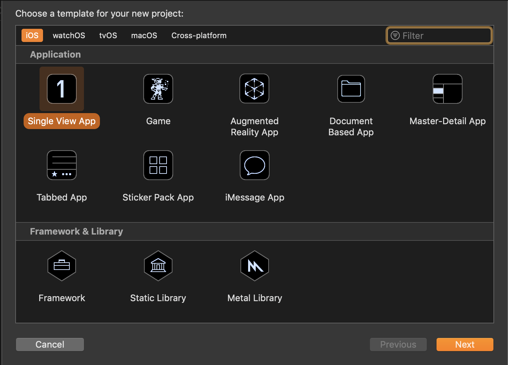
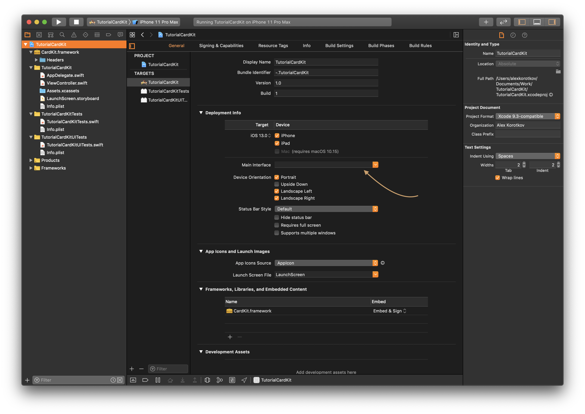
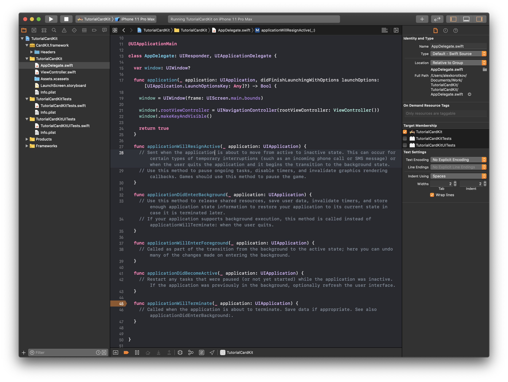
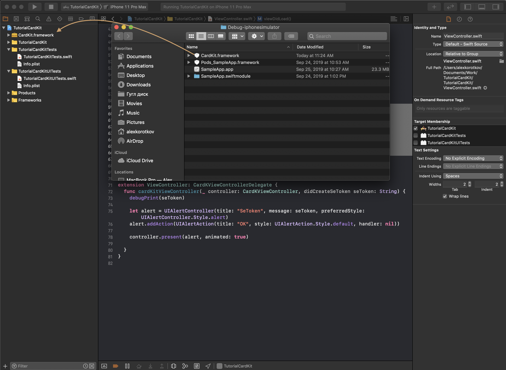
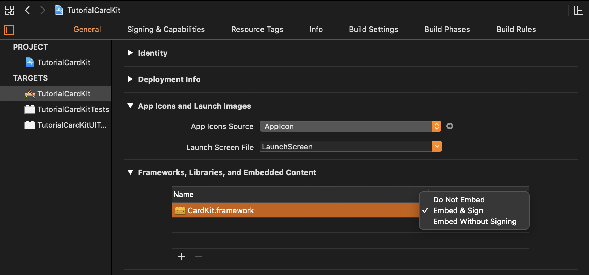
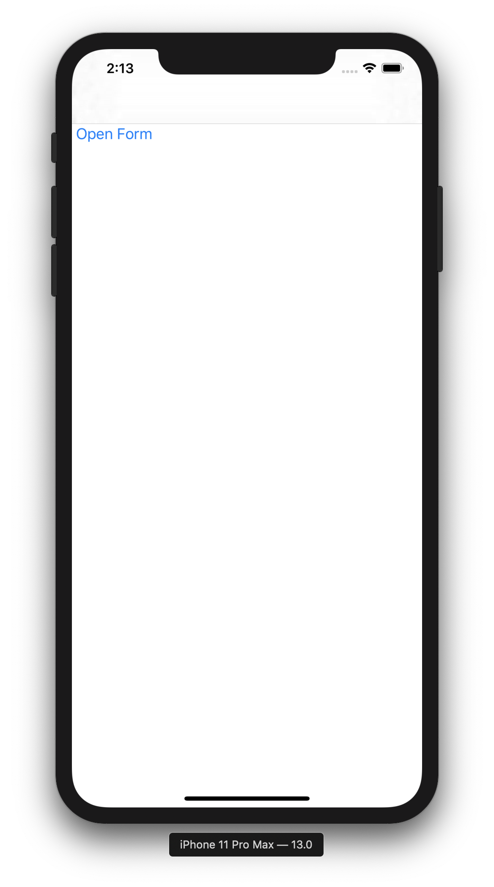
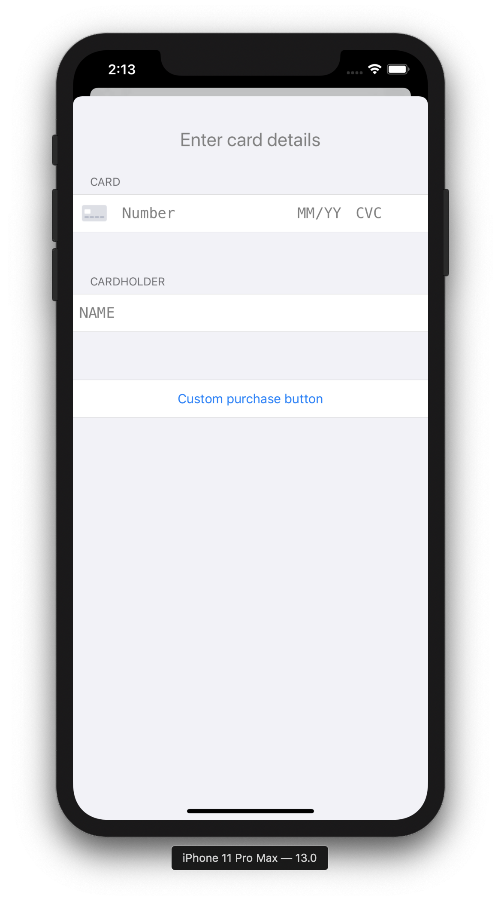

# Туториал CardKit SDK

## 1. Настройка проекта

1.1 Создать проект

<div align="center">
  
</div>
  <div align="center"> Рисунок 1.1. Создание проекта </div>

1.2. Очистить в Target поле `Main interface`

<div align="center">
  
</div>

  <div align="center"> Рисунок 1.2. Пустое поле </div>

1.3 В AppDelegate.swift инициализировать ViewController как первую страницу.

```swift
//AppDelegate.swift
class AppDelegate: UIResponder, UIApplicationDelegate {

  var window: UIWindow?

  func application(_ application: UIApplication, didFinishLaunchingWithOptions launchOptions: [UIApplication.LaunchOptionsKey: Any]?) -> Bool {

    window = UIWindow(frame: UIScreen.main.bounds)

    window!.rootViewController = UINavigationController(rootViewController: ViewController())
    window!.makeKeyAndVisible()

    return true
  }
  ...
```

1.4 В AppDegate.swift реализовать функции.

```swift
 ...
 func applicationWillResignActive(_ application: UIApplication) {}

  func applicationDidEnterBackground(_ application: UIApplication) {}

  func applicationWillEnterForeground(_ application: UIApplication) {}

  func applicationDidBecomeActive(_ application: UIApplication) {}

  func applicationWillTerminate(_ application: UIApplication) {}
}
```

<div align="center">
  
</div>
  <div align="center"> Рисунок 1.3. AppDelegate.swift </div>

**Результат:**

<div align="center">
  
</div>
  <div align="center"> Рисунок 1.4. Результат работы </div>

## 2. Интеграция CardKit.framework

2.1 Взять файл CardKit.framework и перенести файл в папку проекта.

<div align="center">
  
</div>
  <div align="center"> Рисунок 2.1. Перенос файла CardKit.framework </div>

2.2. Открыть Targets -> General -> Frameworks,Libraries, and Embedded Content, У CardKit.framework заменить в колонке embeded c `Do not Embed` на `Embed & Sign`.

<div align="center">
  
</div>
  <div align="center"> Рисунок 2.2. Изменения настроек CardKit.framework </div>

2.3. Импортировать фрэймворк в файле ViewController.swift

```swift
//ViewController.swift
...
import CardKit
...
```

## 3. Использование SDK

3.1 Реализовать функцию cardKitViewController

```swift
//ViewController.swift
extension ViewController: CardKViewControllerDelegate {
  func cardKitViewController(_ controller: CardKViewController, didCreateSeToken seToken: String) {
    debugPrint(seToken)

    let alert = UIAlertController(title: "SeToken", message: seToken, preferredStyle: UIAlertController.Style.alert)
    alert.addAction(UIAlertAction(title: "OK", style: UIAlertAction.Style.default, handler: nil))

    controller.present(alert, animated: true)

  }
}
```

3.2 Реализовать функцию вызова формы

```swift
//ViewController.swift
...
@objc func _openController() {
  CardKConfig.shared.theme = CardKTheme.light();
  CardKConfig.shared.language = "en";

  let controller = CardKViewController(mdOrder:"mdOrder");
  controller.cKitDelegate = self
  controller.allowedCardScaner = false;
  controller.purchaseButtonTitle = "Custom purchase button";
  controller.isTestMod = `false`

  if #available(iOS 13.0, *) {
    self.present(controller, animated: true)
    return;
  }

  let navController = UINavigationController(rootViewController: controller)
  navController.modalPresentationStyle = .formSheet

  let closeBarButtonItem = UIBarButtonItem(
    title: "Close",
    style: .done,
    target: self,
    action: #selector(_close(sender:))
  )
  controller.navigationItem.leftBarButtonItem = closeBarButtonItem
  self.present(navController, animated: true)
}
...
```

3.3 Реализовать функцию закрытия формы

```swift
//ViewController.swift
...
@objc func _close(sender:UIButton){
  self.navigationController?.dismiss(animated: true, completion: nil)
}
...
```

3.4 Добавить кнопку для вызова формы

```swift
 override func viewDidLoad() {
  super.viewDidLoad()

  let button = UIButton.init();
  button.setTitle("Open Form",for: .normal)
  button.addTarget(self, action:#selector(_openController), for: .touchUpInside)
  button.frame = CGRect(x: 0, y: 50, width: 100, height: 100)
  button.setTitleColor(UIColor.systemBlue, for: .normal)

  self.view.backgroundColor = UIColor.white
  self.view.addSubview(button)
}
```

**Результат:**

<div align="center">
  <div align="inline">
  
  
  </div>
</div>
